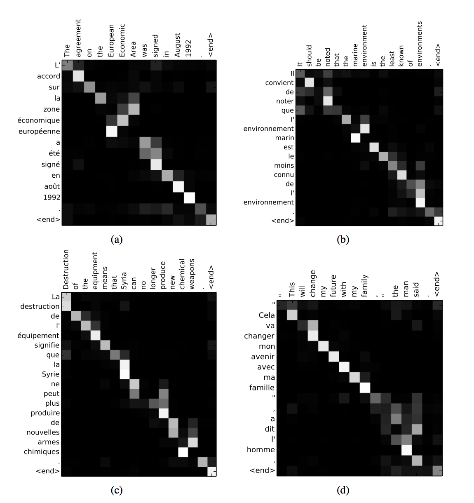

# Sequence to Sequence Models and Attention

Projected is implemented here: https://github.com/rohan-varma/neural-machine-translation

- Features 2 essentially independent networks: an encoder and decoder
- Encoder and decoder are interconnected with a fixed-length vector
- Fixed-length vector is an “encoded” representation of the sentence
- Decoder reads fixed-length representation to produce output translation

**Background and Previous Work**

General problem space - Neural machine translation: map variable-length sequence to another variable-length sequence. This is not just limited to words (although a very common use case) but can be extended to arbitrary items that have some temporal dependency.

- In the above example, [a, b, c, eos] is the input sequence, $$W$$ is the fixed length representation it is encoded into, and [x, y, z, eos] is the output sequence.

- This "sequence to sequence" network is actually 2 networks, an **encoder** and a **decoder** network. 

-  *Encoder* - it reads a source sentence, and encodes it into a fixed-length vector $$ V $$. Also known as a "context".

  The *decoder* reads the fixed-length vector $$ V $$  and outputs a sequence that is the translated sentence. Training is done to maximize the log probability of the translated sentence conditioned on the source sentence.

  - The general problem statement, which holds true across Seq 2 Seq, soft attention, and transformer networks is to estimate $$G =  p(y_1, .... y_{T'} | x_1, ... x_{T})$$ . The sequence to sequence approach makes approximating this simpler by using the fixed-length vector $$ V $$ and modeling: $$ p(y_1 | x_1, .... x_T) = p(y_1 | V) $$. Then by conditional probability, $$p (y_1, y_2 | V) = p(y_2 | v, y_1)p(y_1 | v) $$ and the entire output sequence can be evaluated this way.

  

**RNN-Based encoder decoder** - model setup

- **Seq to Seq Encoder**

- In the case of machine translation, the *encoder* and *decoder* both tend to be a variant of an RNN. For example, let the following RNN model our encoder:

  

  (Credit: Jay Alammar, [Visualizing a Neural Machine Translation Model](https://jalammar.github.io/visualizing-neural-machine-translation-mechanics-of-seq2seq-models-with-attention/))

- Digression: RNN
  - Instead of an ordinary hidden layer in a neural network that computes $$ y = f(Wx + b)$$we instead maintain hidden states across a series of timesteps, and we pass in our inputs $$ x_t $$ at each timestep:

    $$ h_t = f(W_{xh} x_t + W_{hh} h_{t-1} + b_{xh}) $$

    $$ y_t = f(W_{hy}h_t + b_{hy}) $$ (where $$ f $$ can be the softmax function, for example)

  - Note that weights are *shared across time*, i.e. at each timestep $$ t $$, the weight matrix used does not changed. Tying weights across time is similar to the idea of tying weights across space in convolutional neural networks, where the advantage there is that we have spatial and translational invariance (i.e. intuitively it doesn't matter where the actual dog in the picture is, we only want to know *if* there is a dog in the picture.)
  - If you unfold an RNN, you can think of it as a very deep network with $$ t $$ layers, but remember that the weight matrices are shared. 
  - RNNs are commonly *stacked* to form multiple layers of hidden states. If there are multiple layers of hidden states, then instead of xt as the input into a later hidden layer, the input is the ht at the previous layer, same timestep.
  - Stacking is very common. Sutskevar et. al in [Sequence to Sequence Learning](https://arxiv.org/pdf/1409.3215.pdf) used a deep LSTM with 4 layers and the [transformer paper](https://papers.nips.cc/paper/7181-attention-is-all-you-need.pdf) uses an RNN-based encoder with 6 layers.

- We have an input $$ x_1, ... x_T $$ and want to output a context/fixed-length vector $$ c $$. In the encoder-decoder framework used in [Neural Machine Translation](https://arxiv.org/pdf/1409.0473.pdf) this is done via an RNN: $$ h_t = f(x_t, h_{t-1}) $$. Now given some $$ (h_1, ... h_T) $$ we apply $$ g(h_1, ... h_T) = c $$ to get the fixed-length vector. In the paper, it is just $$ g(...) = h_T $$, meaning that the final hidden state is the intermediate, fixed-length encoding representation. 
- **Seq to Seq Decoder**
- Given $$ c $$, we need to decode it now to produce our output sequence $$ y_1, ... y_{T'} $$. 

- Goal: predict next $$ y_t $$ given the context vector $$ c $$ and the previous $$ y_1 … y_{t-1} $$ 's. We define the probability of the translation as $$p(y_1 … y_T\mid c) = p(y_1 \mid c) * p(y_2 \mid y_1, c) * … p(y_t \mid y_1, … y_{t-1},c) = \prod_{t=1}^{T}p(y_t \mid y_1 … y_{t-1},c) $$. This essentially means that we are training to predict the next word given the context vector and all the previous words.

- In the decoder network, each of these conditional probabilities is defined using an RNN:

  $$ p(y_t \mid y_1, … y_{t-1},c) = g(y_{t-1}, s_{t-1}, c) $$ i.e. each probability is computed as a function of the previous prediction at the previous timestep (we can also feed in the true label during training, which is known as *teacher forcing*), the current hidden state, and the intermediate context vector. We update the hidden state at each timestep similar to how we did it with the encoder RNN: $$ s_t = h(s_{t-1}, y_{t-1}) $$.
  
  

This required the construction of a fixed-length representation (vector) as an intermediate step between encoder and decoder

- Hypothesized to be limiting, especially for long sequences, since a lot of information needs to be stored in a fixed size.
- **Intuition on why it is problematic for long sequences: ** The problem with long sequence is also seen if you make an analogy for what human translators do: they don't just memorize an entire sentence and then split out the translation for it (especially not for longer sentences) - they read a part of the sentence, store some information, produce part of the translation, read the next portion of the sentence, update their information, produce more of the sentence, etc.

**Enhancing the above with Attention** 

- The *context* vector is problematic in the above case. It reduces the accuracy especially on longer sequences, and in the decoding stage, the same context vector is used, and there is no way to "pay attention" to specific parts of the input that might warrant a larger influence at a certain timestep, because that information is gone. 
- Analogy to human translators from the beginning.

##### How you could have invented attention

- Before diving into how attention is implemented in the paper, let's see how we ourselves might come up with a simpler version of attention. The main intuition is that instead of using a same context vector at each decoding timestep $$ c $$, we want to use a per-timestep specific context $$ c_i $$. How would we generate $$ c_i $$? Let's try to generate $$ c_i $$ such that it captures more information. 
- **Attempt 1: ** Let $$ c_i $$ = $$ \sum_{k=1}^{T} a_k h_k $$ basically a weighted some of each of the encoder's hidden states. But this doesn't work since $$ c_i$$ is still the same across the decoder.
- **Attempt 2**: Let $$ c_i = \sum_{k=1}^T a_{i,k}h_k $$. Now, we have a different $$ a_i = [a_{i,1}, ... a_{i, T}] $$ for each decoder timestep! This is simply linearly transforming our hidden states, and the weights here will be learned jointly with backprogation. The intuition is that at each timestep in the decoder $$ i $$, $$ a_k $$ will be large if the hidden state for that timestep is more important to the output and we need to "pay attention" to it. The weights for less important hidden states will be smaller. We need different $$ a_k$$ for each timestep $$ i $$ of course, since different timesteps will want to pay attention to different hidden states. 
  - All this does is linearly weight our hidden states differently for each context. 
- **Attempt 3** (Actual attention in the paper)

- Given that we have our input sequence, we run it through a (bidirectional in the paper) RNN to get hidden states $$ a^i $$ for each $$ i $$ in the sequence. (There are actually both forward and backward activations if we use a bidirectional RNN, but we can simply take the concatenation to get a single activation).
- One of the goals of the attention model is to compute *attention weights* $$\alpha_{ij} $$ where $$ \alpha_{ij} $$ indicates intuitively, when we're generating word $$ i $$ in the output translation, how much attention should we pay to word $$ j $$ in the source sentence? These values are used to weight the hidden states $$ a^j $$ generated by the encoder. The below figure shows this:

- In the figure above, the bottom network is a **bidirectional RNN encoder** and the $$ a^0 $$ is the concatenated forward and backward hidden state produced. The above network is a **forward-only decoder** that takes as input some context $$ c_i $$ and the previous hidden state that it produced and outputs a prediction and new hidden state. 

- At each timestep $$ t$$, the decoder takes in its previous hidden state $$ s_{t-1} $$ , the context vector $$ c_{t} $$ and produces an output $$ y $$ and a new hidden state $$ s_t $$. For now, let's only consider the first timestep.

- We define $$ c_1 = \sum_{T} \alpha_{1, i} a^i $$ where $$ \alpha_{1, i} $$ are the "weights" or "scores" for each hidden state, *specific to timestep 1*. We further constrain $$ \sum_{T} \alpha_{1, i} =1$$. In this case, each $$ \alpha $$ represents the amount of "attention" that the first output should pay to the $$i$$th hidden state generated by the decoder. In general, $$ c_i = \sum_{j}^{T_x} \alpha_{ij}a_j$$ .

- We can continue this: after generating hidden state $$ s_1 $$ and producing output $$ y_1 $$, we then need to repeat this process in order to get the second output: 

  - we somehow (explained later) compute $$ \alpha_{2i} $$ for all $$ i $$ in the input sentence, and use this to calculate $$ c_2$$, and our next state $$s_2 $$ is a function of the previous state $$ s_1 $$, this new context $$ c_2 $$, and our previous translation output $$ y_1 $$. This is then used to compute a function for our next translation result $$ y_2 $$ which relies on the new state $$ s_2$$, the new context vector $$ c_2$$ and the previous translation output.

    

##### Calculating the attention weights $\alpha_{ij} $ 

- We remember that the term $$ \alpha_{ij} $$ denotes the amount of attention that the output word at time $$ i $$ should pay to the input word at time $$ j $$.

- We have $$\alpha_{ij} = \frac{\exp{e_{ij}}}{\sum_{k=1}^{Tx}\exp e_{ik}} $$ which is essentially a softmax over the vector $$ e_i $$. This ensures that the attention weights sum to $$ 1 $$ and can be interpreted as probabilities.

- Each $$ e_{ij} $$ is computed as a function of the decoder RNN's previous hidden state activation (so the activation at time $$ i - 1 $$, note that we do not have access to the hidden state at the current timestep yet ) and the hidden state $$ a_j$$ of the encoder RNN.

- Intuitively, since we are decided how much attention to pay when generating the output for a particular timestep, it is reasonable to consider the hidden state from the previous timestep and the hidden state features generated by the encoder network on the input. 

- For example, $$ \alpha_{1, j} = f(s_0, a_j) $$ where $$ f $$ is a small, usually 1 hidden layer NN. 

- Note that for a fixed $$ i $$ such as $$ i = 1$$, we can compute $$\alpha_{1j}, 1 \leq j \leq T_x $$ independently of each other (where $$ T_x$$ is the size of our input sequence) (assuming that all the hidden states $$a_j$$ for our bidirectional encoder RNN have been computed) , **but the computation of any of the $$\alpha_{2j}$$'s are blocked** on the computation of the next hidden state ($$ s_1$$, for which we need the context vector $$c_1$$ for, for which we need *all* the previous $$\alpha_{1j}$$'s for). Therefore, for any $$ i $$, we need to have computed $$\alpha_{i1}, \alpha_{i2}, … \alpha_{iT_x}$$ before computing $$\alpha_{i+1j}$$ 

- The function used to compute $$ e_{ij} $$ is a small, usually single-layer neural network with inputs $$s_{i-1} $$ (previous hidden state of our decoder RNN) and $$a_j$$ ($$j$$th hidden state of our encoder network)

- This network is jointly trained with the rest of the network with one giant backpropagation, meaning that the gradient of the cost function flows through it and it is not trained separately from the main task.

- The below figure illustrates how the attenion weights are computed.

- **Downside: quadratic cost** since there are T^2 weight values.

  

#### Complete model description

- First, we need to produce what the authors call "annotations". Each annotation $$a_i$$ is the *concatenation* of a bidirectional RNN's backward and forward hidden states $$h_{i, forward}$$ and $$ h_{i, backward}$$ at each timestep.

  - The bidirectional RNN is used because for the current word, we want to summarize not only the preceding words but also the following words. Since RNN's tend to focus on recent inputs, the annotation $$a_j$$ will be focused in the window of words around $$x_j$$. 

- We now have a sequence of annotations $$a_j, 0 \leq j \leq T_x$$.

- Next, we'd like to compute our first context vector $$ c_i$$, but for this we need our attention weights $$\alpha_{1j}$$, so we need to calculate $$e_{1j}$$ from our alignment model. We have $$e_{1j} = a(s_0, a_j), 0 \leq j \leq T_x$$ which is the output of a simple one-layer neural network. Now, we can run softmax to compute our alpha values $$\alpha_{1j}$$. 

- Now, we can compute our context vector: $$c_{1} = \sum_{j=1}^{T_x}\alpha_{1,j}a_j$$ since we have $$ a_j$$ as our encoder RNN output and $$ \alpha_{1,j}$$ as our attention weight, that tells us for each input word $$ j $$ how much attention we should pay to it to produce the first word in our resulting translation.

- Given this context vector, we can apply a function to compute the next state: $$ s_1 = f(s_0, y_0, c_1)$$ where $$ s_0$$ is an initial hidden state, $$ y_0$$ is the initial word (such as a start token) and $$ c_1$$ is the time-specific context we just created.

- Using this new hidden state, we generate our output at this timestep $$ y_1$$: $$ p(y_1 \mid y_0, x) = g(y_{0},s_1, c_1)$$

- We note that to compute $$e_{2j}$$ in order to get the attention weights for the 2nd output, *we need access to* $$s_2$$ s1, so we must compute $$ s_1$$ before being able to compute the next set of attention weights.

- The general formulas are:

  $$ e_{ij}= a(s_{i-1}, a_j)$$, $$ c_i = \sum_{j=1}^{T_x} \alpha_{ij}a_j$$ , $$s_i = f(s_{i-1}, y_{i-1}, c_i)$$ and $$ y_i = g(y_{i-1}, s_i, c_i)$$ 

##### Details on bidirectional RNN

- BiRNN consistens of forward and backward RNNs - forward RNN reads the input sequence as it is given, and produces forward hidden states. The backwards RNN reads the sequence in revserse order, resulting in calculating a sequence of backwards hidden states
  - Result is concatenated to produce what the authors call "annotations"

##### Visualizing attention weights

- The following figure shows the attention weights that were learned for some example sentence translation pairs. We see that in many cases the weights on the diagonal are more pronounced, since the source word at that index corresponds closely to the same index in the translated word
  - However, in the figure this is not always true. For example, French has a different order of adjectives and nouns, so we see the correct weighting when the system translates [European economic area] into [zone econonomique europeen]

**Attention is all you need**

- Paper proposes the "Transformer" model, which skips recurrence modeling and uses attention entirely to improve accuracy and training speed (via parallelization)
- Observation: RNNs are sequential computation, need input at time $$ t $$ and previous hidden state at $$ t - 1 $$ to get the next output. Elimiates opportunity for parallelism, which is critical at longer sequence lengths. Transformer relies entirely on attention to model dependencies between input and output. 
- Model architecture: stack of 6 encoders, each with connections to a stack of  decoders:
- 
- **Zoom into a single encoder**
- 

- First, words in input sentence go through an embedding layer. In the paper, all encoders receive a list of vector of size 512 (hyperparameter, word embedding size). The resulting embedding is input into the first encoder, and goes through the "self-attention" layer.
- 

- Note that in addition to self attention, there are skip connections and layerNorm before and after feed forward pass. 
- **Overview of self attention**
  - Method used by the transformer to "bake in" the understanding of other words into the word being currently processed.
- Basic operation of self attention: it's a function $$ F : [x_1, x_k] \rightarrow{} [y_1, y_k] $$ where each $$x, y $$ are fixed-dimensional vectors. 
- To generate $$ y_2 $$ 
  - Compute all attention weights $$ w_{2, i} = <x_2  ,x_i >$$ 
  - Let $$ y_2 = \sum_{i=1}^T w_{2i}x_i $$
- 
- Why does this work? Consider manual feature engineering:
- 
- From http://peterbloem.nl/blog/transformers
- Dot product sign indicates whether movie is good match for user or not ; magnitude indicates *importance* of the generated feature
- With self-attention, these "features" are learned parameters of the model (embedding)
- This notion of dot product between features to model their interacations is very common, e.g. factorization machines, recommender systems, etc. 
- Detailed Steps for self attention from the paper:
  - 3 different linear projections of embedding vectors (called Query, Key, and Value). 64 dimensional in the paper. 
  - Then, calculate a score. This involes scoring each word in the input sentence against the current word. Divide and softmax them. 
  - Scale them by the value for each word, and sum up all of these weighted value vectors. This will give the output of self attention for the first word.
  - 
  - Similar process to original soft-attention.
  - Lends itself to parallelization quite well due to the use of matrices (from https://www.slideshare.net/DaikiTanaka7/attention-is-all-you-need-127742932):
  - 
  - **The transformer actually uses multi-headed attention**, which creates multiple sets of query, key, and value matrices. To do multi-headed attention, the queries, keys, and values are projected $$h$$ times with different linear projections different dimensions. Then, self-attention is performed in parallel and the result is concatenated, and then re-projected to attain the final values. According to the paper, this increases the representational capacity of the model. In the paper, $$ 8 $$ different heads are used.
  - During decoding, the output of the top encoder is transformed into a set of attention vectors K and V. Each of these are input to each decoder.
  - A linear layer, plus softmax, followed by an argmax() of the log logits gives us the output words.
  - 

- Attention-based models overcome the fixed-length vector limitation introduced in sequence to sequence models, which was hypothesized to constrain the expressivity at the time.

- Attention can be summarized as modeling some *attention weights* $$ \alpha_{ij} $$ where $$ \alpha_{ij} $$ indicates how important word $$ j$$ in the source sentence is when generating word $$ i $$ in the output. This can be seen by visualizing the learned attention weights, and noting how they are larger when words have stronger associations to each other: 

  

  

- The paper [Neural Machine Translation by Jointly Learning to Align and Translate](https://arxiv.org/pdf/1409.0473.pdf) introduced the *soft-attention approach* which allows the model to automatically soft search for important parts of the source sentence, and pay special attention to these parts during the translation.

- The paper [Attention is all you need]( https://papers.nips.cc/paper/7181-attention-is-all-you-need.pdf) removed the sequential dependency of RNNs by eliminating them and replacing them with a (multi-headed) self-attention mechanism, improving both training speed (due to increasing parallelism) and accuracy. 

###### References

1. Neural Machine Translation by Jointly learning to align and translate: <https://arxiv.org/abs/1409.0473>

2. Attention is all you need: https://arxiv.org/abs/1706.03762

3. Deeplearning.ai explanation of attention models: <https://www.youtube.com/watch?v=FMXUkEbjf9k>

4. Jay Alammar illustrated transformer: https://jalammar.github.io/illustrated-transformer/

5. Jay Alammar: Visualizing NMT: https://jalammar.github.io/visualizing-neural-machine-translation-mechanics-of-seq2seq-models-with-attention/

6. Transformer explained - http://peterbloem.nl/blog/transformers

    