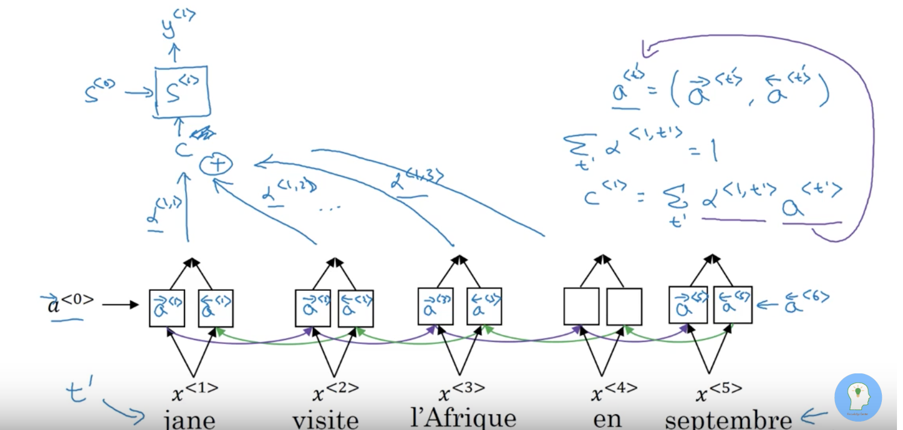

### Notes: Neural Machine Translation by Jointly Learning to Align and Translate

##### Abstract

- Previous approach was 2 networks, an encoder and decoder network
- Required the construction of a fixed-length representation (vector) as an intermediate step between encoder and decoder
  - Hypothesized to be limiting, especially for long sequences, since a lot of information needs to be stored in a fixed size
- This paper introduces the *soft-attention approach* which allows the model to automatically soft search for important parts of the source sentence, and pay special attention to these parts during the translation

##### Introduction

Previous work had an *encoder* - it reads a source sentence, and encodes it into a fixed-length vector

The *decoder* reads the fixed-length vector and outputs a sequence that is the translated sentence. Training is done to maximize the log probability of the translated sentence conditioned on the source sentence.

**Limitation** : need o encode the entire representation into a fixed-length vector (making it harder to remember longer-term dependencies, which can occur in longer sentences)

The problem with long sequence is also seen if you make an analogy for what human translators do: they don't just memorize an entire sentence and then split out the translation for it (especially not for longer sentences) - they read a part of the sentence, store some information, produce part of the translation, read the next portion of the sentence, update their information, produce more of the sentence, etc.

##### Background

Overview of RNN - Instead of an ordinary hidden layer in a neural network that computes $$ y = f(Wx + b)$$we instead maintain hidden states across a series of timesteps, and we pass in our inputs $$ x_t $$ at each timestep:

$$ h_t = f(W_{xh} x_t + W_{hh} h_{t-1} + b_{xh}) $$

$$ y_t = f(W_{hy}h_t + b_{hy}) $$ (where $$ f $$ can be the softmax function, for example)

**Seq to seq encoder**

Inputs: a sequence of vectors $$ x_1 …. x_T $$ of *variable* length, where the overall sequence is the sentence, and each vector represents the encoded word, such as with word2vec.

Output: a fixed-length vector $$ c $$. Often computing by applying a function to the $$ T $$ hidden states we have accumulated, i.e. $$ c = q(h_1 … h_T) $$ , we further often just set $$ q(h_1 … h_T) = h_T $$ , meaning that the final hidden state is the intermediate, fixed-length encoding representation.

**Seq to seq decoder**

- Goal: predict next $$ y_t $$ given the context vector $$ c $$ and the previous $$ y_1 … y_{t-1} $$ 's. We define the probability of the translation as $$p(y_1 … y_T\mid c) = p(y_1 \mid c) * p(y_2 \mid y_1, c) * … p(y_t \mid y_1, … y_{t-1},c) = \prod_{t=1}^{T}p(y_t \mid y_1 … y_{t-1},c) $$

- In the decoder network, each of these conditional probabilities is defined using an RNN:

  $$ p(y_t \mid y_1, … y_{t-1},c) = g(y_{t-1}, s_t, c) $$ i.e. each probability is computed as a function of the previous prediction at the previous timestep (we can also feed in the true label during training, which is known as *teacher forcing*), the current hidden state, and the intermediate context vector. We update the hidden state at each timestep similar to how we did it with the encoder RNN: $$ s_t = h(s_{t-1}, y_{t-1}) $$ where the initial $$ s_0 $$ could simply be $$ h(c)$$, the function applied to the original context vector.

#### Learning to Align and Translate

##### Intuition for what attention is

- Given that we have our input sequence, we run it through a (bidirectional in the paper) RNN to get hidden states $$ a^i $$ for each $$ i $$ in the sequence. (There are actually both forward and backward activations if we use a bidirectional RNN, but we can simply take the concatenation to get a single activation)
- One of the goals of the attention model is to compute *attention weights* $$\alpha_{ij} $$ where $$ \alpha_{ij} $$ indicates intuitively, when we're generating word $$ i $$ in the output translation, how much attention should we pay to word $$ j $$ in the source sentence? These values are used to weight the resulting hidden states. The below figure shows this:

- We can continue this: after generating hidden state $$ s_1 $$ and producing output $$ y_1 $$, we then need to repeat this process in order to get the second output: 

  - we somehow (explained later) compute $$ \alpha_{2i} $$ for all $$ i $$ in the input sentence, and use this to calculate $$ c_2$$, and our next state $$s_2 $$ is a function of the previous state $$ s_1 $$, this new context $$ c_2 $$, and our previous translation output $$ y_1 $$. This is then used to compute a function for our next translation result $$ y_2 $$ which relies on the new state $$ s_2$$, the new context vector $$ c_2$$ and the previous translation output.

  - Remember the interpretation for these $$ \alpha $$ values: for example, $$\alpha_{2,1}$$ tells us how much attention we should pay to the first word in the input when generating output word 2. The goal is to get the model automatically identify which window of the input sentence it should pay special attention to when generating a certain output, so the model "attends to" specific windows while doing its translation.

    

- It remains to show how exactly the context $$ c $$ is defined at each timestep. Intuitively, for context $$ c_i $$, it should emphasize the region of the sentence that we should use when producing the output $$ c_i$$. It relies on $$ \alpha $$ and the encoder hidden states $$ a^i $$ . 

- It also remains to show exactly how $$\alpha$$ values are calculated, which indicate how much attention we should pay to a particular word when generating a particular output word. Each $$\alpha_{ij} $$ is influenced by the encoder RNN's hidden state at time $$ j $$, and the *decoder RNN'*s hidden state at time $$ i - 1$$ (which in turn comes from the previous context and $$\alpha$$ values. 

##### Calculating the time-specific context vectors and attention weights

- The context at each timestep will be defined as a weighted sum of the activations, where the activations are weighted by the $$\alpha$$ values. 
- To calculate the context vectors, first we take the concatenation of the bidirectional RNN activations: $$ a^i = [a^i_{forward}, a^i_{backward}]$$
- Next, we have $$ c_1 = \sum_{j}^{T_x} \alpha_{1,j}a_j$$ , where we sum across all $$ j $$ in the input sequence, and in general $$ c_i = \sum_{j}^{T_x} \alpha_{ij}a_j$$ 
- We once again have $$\alpha_{t, t'} = $$ amount of attention that output $$ y_t $$ should pay to the encoder hidden state $$ a_{t'} $$, which is directly computed from the $$t'$$th input word.

- This is done sequentially, so our above network becomes a standard RNN known as the decoder network:

  

##### Calculating the attention weights $\alpha_{ij} $ 

- We remember that the term $$ \alpha_{ij} $$ denotes the amount of attention that the output word at time $$ i $$ should pay to the input word at time $$ j $$.

- We have $$\alpha_{ij} = \frac{\exp{e_{ij}}}{\sum_{k=1}^{Tx}\exp e_{ik}} $$ which is essentially a softmax over the vector $$ e_i $$. This ensures that the attention weights sum to $$ 1 $$ and can be interpreted as probabilities.

- Each $$ e_{ij} $$ is computed as a function of the decoder RNN's previous hidden state activation (so the activation at time $$ i - 1 $$, note that we do not have access to the hidden state at the current timestep yet ) and the hidden state $$ a_j$$ of the encoder RNN

- Note that for a fixed $$ i $$ such as $$ i = 1$$, we can compute $$\alpha_{1j}, 1 \leq j \leq T_x $$ independently of each other, **but the computation of any of the $$\alpha_{2j}$$'s are blocked** on the computation of the next hidden state ($$ s_1$$, for which we need the context vector $$c_1$$ for, for which we need the previous $$\alpha_{1j}$$'s for). Therefore, for any $$ i $$, we need to have computed $$\alpha_{1j}, \alpha_{2j}, ...\alpha_{ij} $$ before computing $$\alpha_{i+1j}$$ 

- The function used to compute $$ e_{ij} $$ is a small, usually single-layer neural network with inputs $$s_{i-1} $$ (previous hidden state of our decoder RNN) and $$a_j$$ ($$j$$th hidden state of our encoder network)

- This network is jointly trained with the rest of the network with one giant backpropagation, meaning that the gradient of the cost function flows through it and it is not trained separately from the main task.

- The below figure illustrates how the attenion weights are computed.

  

#### Complete model description

- First, we need to produce what the authors call "annotations". Each annotation $$a_i$$ is the *concatenation* of a bidirectional RNN's backward and forward hidden states $$h_{i, forward}$$ and $$ h_{i, backward}$$ at each timestep.

  - The bidirectional RNN is used because for the current word, we want to summarize not only the preceding words but also the following words. Since RNN's tend to focus on recent inputs, the annotation $$a_j$$ will be focused in the window of words around $$x_j$$. 

- We now have a sequence of annotations $$a_j, 0 \leq j \leq T_x$$.

- Next, we'd like to compute our first context vector $$ c_i$$, but for this we need our attention weights $$\alpha_{1j}$$, so we need to calculate $$e_{1j}$$ from our alignment model. We have $$e_{1j} = a(s_0, a_j), 0 \leq j \leq T_x$$ which is the output of a simple one-layer neural network. Now, we can run softmax to compute our alpha values $$\alpha_{1j}$$. 

- Now, we can compute our context vector: $$c_{1} = \sum_{j=1}^{T_x}\alpha_{1,j}a_j$$ since we have $$ a_j$$ as our encoder RNN output and $$ \alpha_{1,j}$$ as our attention weight, that tells us for each input word $$ j $$ how much attention we should pay to it to produce the first word in our resulting translation.

- Given this context vector, we can apply a function to compute the next state: $$ s_1 = f(s_0, y_0, c_1)$$ where $$ s_0$$ is an initial hidden state, $$ y_0$$ is the initial word (such as a start token) and $$ c_1$$ is the time-specific context we just created.

- Using this new hidden state, we generate our output at this timestep $$ y_1$$: $$ p(y_1 \mid y_0, x) = g(y_{0},s_1, c_1)$$

- We note that to compute $$e_{2j}$$ in order to get the attention weights for the 2nd output, *we need access to* $$s_2$$ s1, so we must compute $$ s_1$$ before being able to compute the next set of attention weights.

- The general formulas are:

  $$ e_{ij}= a(s_{i-1}, a_j)$$, $$ c_i = \sum_{j=1}^{T_x} \alpha_{ij}a_j$$ , $$s_i = f(s_{i-1}, y_{i-1}, c_i)$$ and $$ y_i = g(y_{i-1}, s_i, c_i)$$ 

##### Details on bidirectional RNN

- BiRNN consistens of forward and backward RNNs - forward RNN reads the input sequence as it is given, and produces forward hidden states. The backwards RNN reads the sequence in revserse order, resulting in calculating a sequence of backwards hidden states
  - Result is concatenated to produce what the authors call "annotations"

##### Visualizing attention weights

- The following figure shows the attention weights that were learned for some example sentence translation pairs. We see that in many cases the weights on the diagonal are more pronounced, since the source word at that index corresponds closely to the same index in the translated word
  - However, in the figure this is not always true. For example, French has a different order of adjectives and nouns, so we see the correct weighting when the system translates [European economic area] into [zone econonomique europeen]

###### References

1. Neural Machine Translation by Jointly learning to align and translate: <https://arxiv.org/abs/1409.0473>

2. Deeplearning.ai explanation of attention models: <https://www.youtube.com/watch?v=FMXUkEbjf9k>

   ​